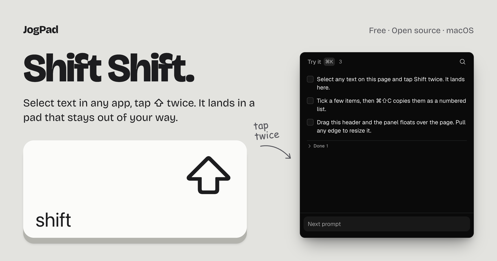

# JogPad

Select text in any app, tap Shift twice, and it lands in a pad that stays out of
your way. Tick a few later, copy them as a numbered list, paste the lot into a
prompt.

<p align="center">
  <a href="https://jogpad.fishball.app">
    
  </a>
</p>

**[jogpad.fishball.app](https://jogpad.fishball.app)** has the download, the
shortcuts, the install steps, and the pad itself running in the page so you can
try the gesture before installing anything. Everything below is for people who
want to build it.

macOS only. Free, MIT, no account, no sync, no telemetry. Your notes are one
markdown file under `~/Library/Application Support/com.ycmjason.jogpad/`.

## Running it from source

Needs Node, pnpm, and a Rust toolchain new enough for Tauri 2 (1.85+).

```sh
pnpm install
pnpm dev
```

macOS asks for Accessibility access the first time you double-tap Shift. Without
it the app still works as a scratchpad, it just cannot read other apps'
selections.

`pnpm vite` inside `apps/desktop` runs the same UI in a browser tab on an
in-memory host, for front-end work that does not need a Rust build.

## Layout

```
packages/ui              the pad: React UI, the notes model, and the gesture rule
apps/desktop/src         desktop host: Tauri bindings for files, window, permissions, updates
apps/desktop/src-tauri   Rust: file writes, event tap, selection reader, NSPanel, updater
apps/site                the Astro site, which runs the same pad in the browser
```

All notes logic lives once, in `packages/ui`. A host only implements side
effects (`packages/ui/src/host.ts`); the desktop and the site each provide one.

```sh
pnpm test:ui   # the markdown round trip and every mutation
pnpm test      # the double-tap detector and the file paths (Rust)
```

## Releasing

Add a `## <version>` section to `CHANGELOG.md`, bump the version in
`apps/desktop`, then tag it:

```sh
git tag v0.1.6 && git push --tags
```

[The workflow](.github/workflows/release.yml) refuses a tag with no changelog
section, builds a signed and notarised universal DMG on a macOS runner, and
attaches it to a draft release. Nothing goes public until you publish the
draft.

Every push to `main` also publishes a dev build on its own, served to the Dev
update channel in Settings. Stable, Beta and Dev are a toggle there, not
separate installs.

## Licence

MIT. See [LICENSE](LICENSE).

JogPad started as a clone of [Copper](https://shadcn.com/copper) by shadcn,
built from its public description. No code from Copper was used, and it is not
affiliated with or endorsed by shadcn.
