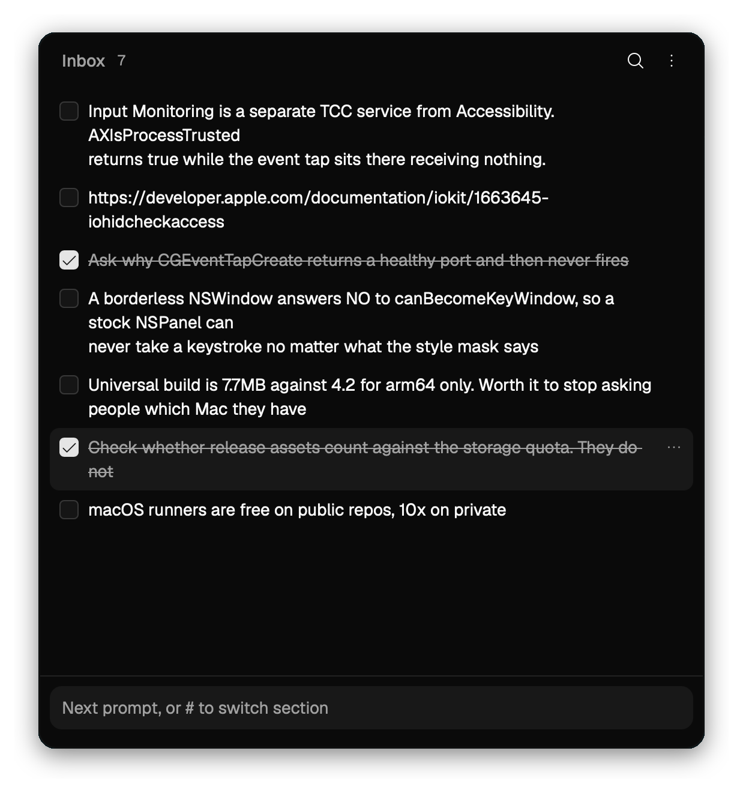

# JogPad

A clone of [Copper](https://shadcn.com/copper): a macOS sidebar for the snippets you
want to keep and the prompts you want to send next while working with an AI.

Select text in any app, tap `Shift` twice, and it lands in the sidebar. The sidebar
shows itself without taking the keyboard, so you keep reading where you were. Pick
several items later, hit `⌘⇧C`, and paste them as a numbered list into a prompt box.

<p align="center">
  
</p>

Everything is one markdown file under `~/Library/Application Support/com.ycmjason.jogpad/notes.md`.
No account, no sync, no telemetry.

JogPad owns the shape of that file: `##` headings are sections, task-list entries are
items. It rewrites the whole file whenever you capture or edit, so freeform markdown it
does not model will not survive. Reading it, copying from it and diffing it are all
fine. Hand-editing it alongside JogPad is not.

## Shortcuts

| Keys | What happens |
| --- | --- |
| `Shift` `Shift` | With text selected: capture it and show the sidebar. With nothing selected: open the sidebar and focus the input. While JogPad has the keyboard: hide it |
| `⌘K` | Switch or create a section |
| `⌘⇧C` | Copy the selected items as a numbered list |
| `⌘F` | Search across every section |
| `⌘A` | Select everything visible |
| `↑` / `↓` | Move the selection, `⇧` to extend it |
| `⌫` | Delete the selected items |
| `⌘-` / `⌘+` / `⌘0` | Zoom out, in, or back to 100%. The window resizes with it |
| `⌘W` | Hide the sidebar. Capture keeps working while it is hidden |
| `⌘Q` | Quit |
| `Enter` / `⇧Enter` | While editing an item: save, or start a new line |

Clicking the menu bar icon toggles the sidebar; right-clicking it opens Show, Hide and
Quit. The same commands live behind the ⋮ button in JogPad's own header, because an
accessory app has no menu bar of its own. Hiding only hides the window, so
double-tapping Shift still files captures away.

The panel border brightens while JogPad has keyboard focus and dims when it does not.
There is no title bar to carry that signal otherwise.

## Installing

Grab the DMG from [Releases](https://github.com/fishballapp/jogpad/releases). One
universal build covers Apple silicon and Intel.

Drag JogPad to `/Applications`, then open it and grant Accessibility access when asked.
Install *before* granting: macOS keys the grant to the app's path and code signature, so
moving it afterwards means granting again.

Watching the keyboard actually needs two separate grants, Accessibility and Input
Monitoring. JogPad asks for the second one itself once the first lands, and macOS hands
it over without a prompt, so there is normally nothing to do. If the banner stays up,
clicking it opens the right pane in System Settings.

If macOS calls the app damaged, that build went out unsigned. Clear the quarantine
flag and it will open:

```sh
xattr -dr com.apple.quarantine /Applications/JogPad.app
```

## Running it

Needs Node, pnpm, and a Rust toolchain new enough for Tauri 2 (1.85+).

```sh
pnpm install
pnpm dev
```

macOS will ask for Accessibility access the first time you double-tap Shift. Without it
the app still works as a scratchpad, it just cannot read other apps' selections.

## Layout

```
apps/desktop/src         React front end
apps/desktop/src-tauri   Rust: markdown store, event tap, selection reader, NSPanel
```

`cargo test --manifest-path apps/desktop/src-tauri/Cargo.toml` covers the markdown
round trip and the double-tap detector.

## Releasing

Tag a version and CI does the rest:

```sh
git tag v0.1.0 && git push --tags
```

[The workflow](.github/workflows/release.yml) typechecks, runs the Rust tests, builds
a universal DMG on a macOS runner and attaches it to a draft release. Nothing goes
public until you publish it. macOS is not optional there: `hdiutil`, `codesign` and
the AppleScript that styles the DMG window exist nowhere else.

Builds are signed and notarised when the Apple credentials are present as repository
secrets, and fall back to ad-hoc signing when they are not.

## Licence

MIT. See [LICENSE](LICENSE).

JogPad is an independent reimplementation of [Copper](https://shadcn.com/copper),
built from its public description. No code from Copper was used, and it is not
affiliated with or endorsed by shadcn.
